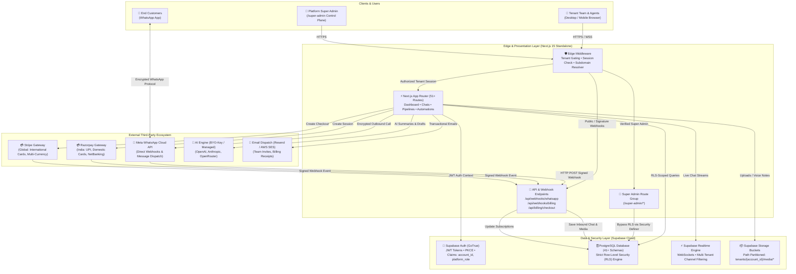
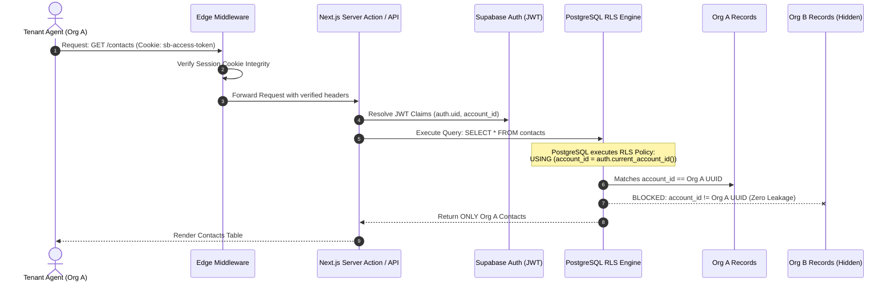
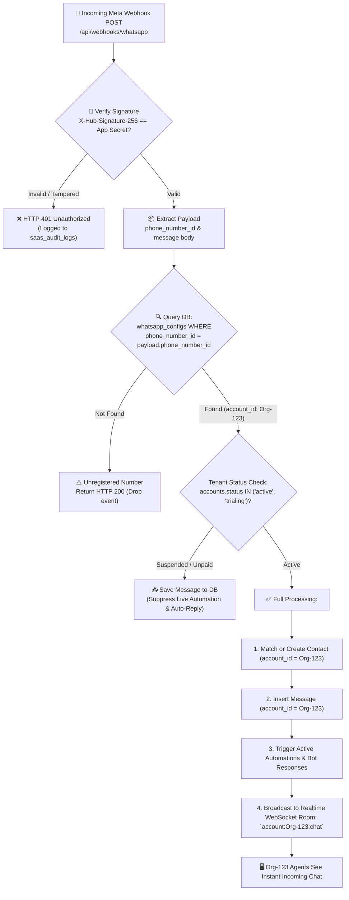
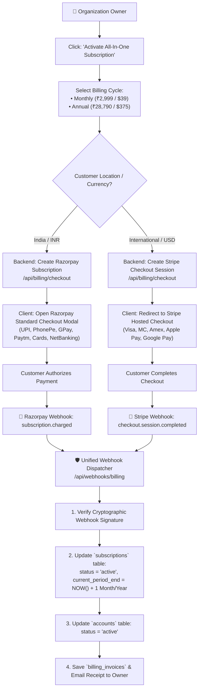
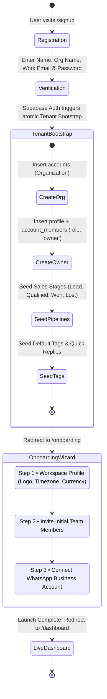
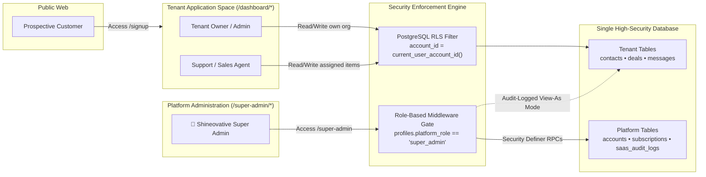
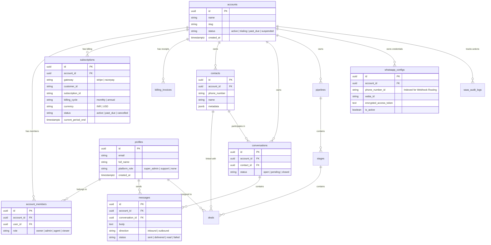

# Shineovative WhatsApp CRM SaaS — Visual System Design & Architecture

> **Purpose:** This document provides an exhaustive, visual end-to-end blueprint of the Shineovative WhatsApp CRM SaaS system architecture, data flows, multi-tenant isolation, webhook dispatching, unified billing, and database entity relationships.

---

## 1. High-Level Platform Architecture

The platform is designed as a cloud-native, high-concurrency, single-database multi-tenant system. All tenant operations are isolated at the database engine level via PostgreSQL Row Level Security (RLS).

---

## 2. Multi-Tenant Request Isolation & RLS Gating Flow

Every single inbound client request travels through a 4-layer security barrier before accessing database records. Data isolation is physically enforced by the PostgreSQL query planner.

---

## 3. Multi-Tenant Inbound WhatsApp Event Routing

Multiple independent businesses share the same application webhook endpoint, but their messages and customer chats are strictly routed based on the Meta `phone_number_id`.

---

## 4. Unified Billing & Payment Flow (Razorpay + Stripe)

A clean, unified checkout experience that automatically presents India-optimized payment methods (UPI, NetBanking) or International payment options (Stripe Global Cards) without complicating the business model.

---

## 5. Customer Self-Serve Onboarding Flow

---

## 6. Super Admin Control Plane vs Tenant Separation

---

## 7. Multi-Tenant Database Entity Relationship Diagram (ERD)

